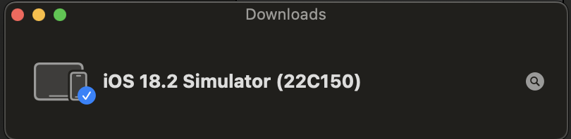

# Setup to run Flutter App on IPhone Simulation 

## On IPhone

### Requirment

+ XCode
+ IOS Simulator

  

## Simulation

1. Open folder iOS on Xcode

2. Install IOS simulator
3. Run

# Note

# Hanoi, December 2024 
