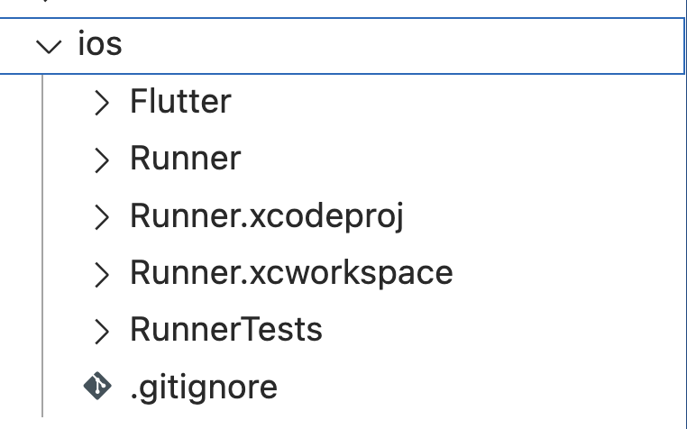

# Setup to run Flutter App on IPhone Simulation 

## On IPhone's Simulation (Apple Device)

### Requirements

+ XCode
+ IOS Simulator

## Simulation

Step 1. Open folder iOS on Xcode

Step 2. Install IOS simulator

 

Step 3. Run

# Note
Any Questions please ?

# Hanoi, December 2024 
