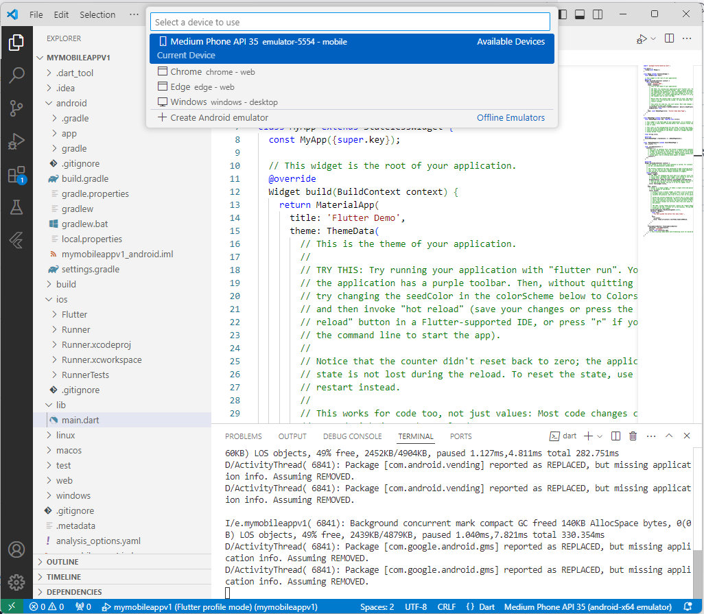
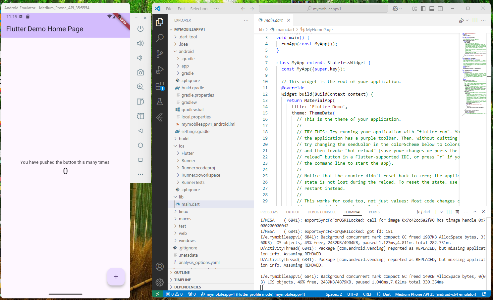

# Setup to run Flutter App on Android Mobile Device Simulation 

## On Android

### Requirment

+ Visual Studio Code
+ Device Connected Simulation (setup) directly with recent flutter version
  
```
flutter --version
Flutter 3.27.1 • channel stable • https://github.com/flutter/flutter.git
Framework • revision 17025dd882 (2 days ago) • 2024-12-17 03:23:09 +0900
Engine • revision cb4b5fff73
Tools • Dart 3.6.0 • DevTools 2.40.2
```


## Simulation




# Note


```
From version 2.13.0 of Dart Code,
emulators can be launched directly from within Visual Studio Code,
Recent Flutter SDK.
```

# Hanoi, December 2024 
