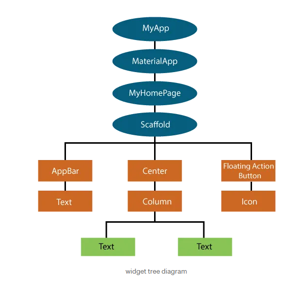
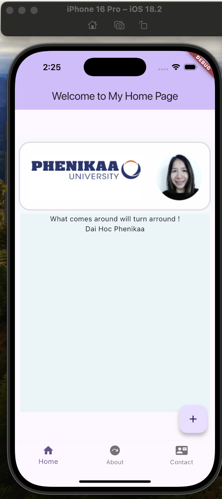
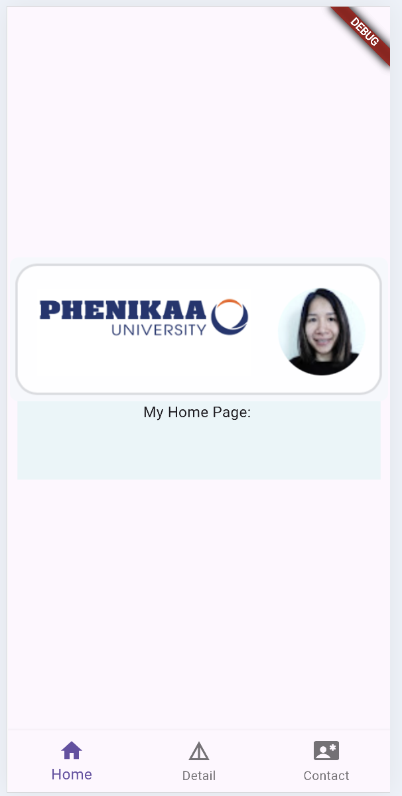
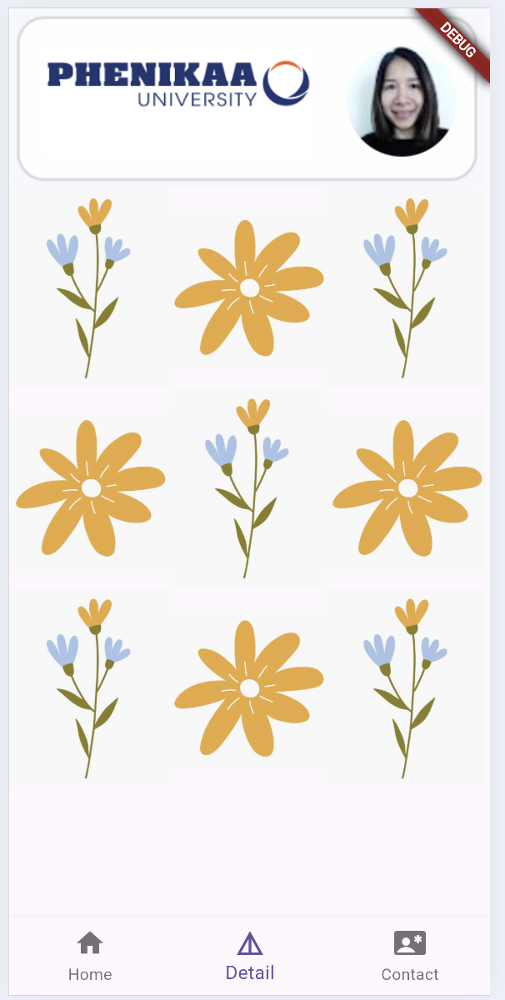
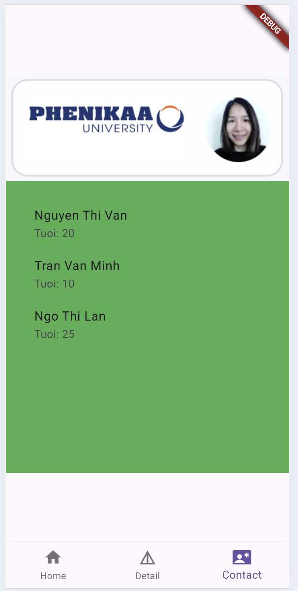

# First App Review 

## Widget Tree



## Packages

The link for package reference
Tài liệu tham chiếu cho các Gói (các lớp giống nhau được đóng gói trong thư mục)

[Packages- Gói](https://pub.dev/packages?q=documentation)

### Footer Package

[Footer](https://pub.dev/documentation/footer/latest/)
[Footer Class) (https://pub.dev/documentation/footer/latest/footer/Footer-class.html)

#### Properties (Thuộc tính)

+ padding --> Class (Kiểu)  là EdgeInsetsGeometry

In which (Trong đó)  
EdgeInsetsGeometry class abstract, base class for EdgeInsets that allows for text-direction aware resolution.
  
  

## My first App



## App with Navigation

| Screen 1 : Home | Screen 2 : Detail | Screen 3 : Contact |
| :--- | :---: | ---: |
|  |  |  |

## Code Example

```
import 'package:flutter/material.dart';
import 'package:flutter/widgets.dart';
import 'package:flutter/src/widgets/basic.dart';

import 'package:mymobileapp/front/MyDetailPage.dart';
import 'package:mymobileapp/front/MyContactPage.dart';
import 'package:mymobileapp/front/MyHomePage.dart';

import '../entities/User.dart' show User;
import '../entities/Bookingks.dart' show Bookingks;
import '../services/Listsinhvien.dart' show Listsinhvien;

import 'package:mymobileapp/test/Testsv.dart';
import 'package:mymobileapp/entities/Sinhvien.dart';

class BottomNavigationPage extends StatefulWidget {
  const BottomNavigationPage({super.key, required this.title});

  final String title;
  
  @override
  State<BottomNavigationPage> createState() => _BottomNavigationPageState();
}

extension Hexcolor on Color {
  static Color fromHex(String hexString) {
    final buffer = StringBuffer();
    if (hexString.length == 6 || hexString.length == 7) buffer.write('ff');
    buffer.write(hexString.replaceFirst('#', ''));
    return Color(int.parse(buffer.toString(), radix: 16));
  }
}

//Extension allow you to add new functionality to existing classes without modifying them or using inheritance.
class _BottomNavigationPageState extends State<BottomNavigationPage> {
 

  int _currentIndexSelected = 0;
  void _onItemTapped(int index) {
    setState(() {
      _currentIndexSelected = index;
    });
  }
   final List<Widget> _tabs = [
    MyHomePage(),
    MyDetailPage(),
    MyContactPage(),
  ];
  
  @override
  Widget build(BuildContext context) {
  
    return MaterialApp(
    
      home: Scaffold(
     
        body:
        /*IndexedStack(
          index: _currentIndexSelected,
          children: const [
            MyHomePage(title: "Home"),
            MyDetailPage(title: "Detail"),
            MyContactPage(title: "Contact"),
          ]
        ),*/
        
     
        _tabs[_currentIndexSelected],
        bottomNavigationBar: BottomNavigationBar(
          items: const [
            BottomNavigationBarItem(
              label: "Home", 
              icon: Icon(Icons.home)),
            BottomNavigationBarItem(
              label: "Detail",
              icon: Icon(Icons.details),
            ),
            BottomNavigationBarItem(
              label: "Contact",
              icon: Icon(Icons.contact_emergency),
            ),
          ],
          currentIndex: _currentIndexSelected,
          onTap: _onItemTapped,
        ),
      ),
    );
  }
}


```
# Practice WEEK 4 (Yêu cầu bài thực hành tuần 4)

Group Assignment
+ Design Screens
  
  1. Home
     
  2. Content

  3. About
     
Each Screen has Column Layout

 1.  Header : Image of Group Student
    
 3.  Body : Content
    
 5.  Footer: Phenikaa University, Student Name

+ Bottom Navigation Bar

# Note


```
From version 2.13.0 of Dart Code,
emulators can be launched directly from within Visual Studio Code,
Recent Flutter SDK.
```

# Hanoi, May 2026 
